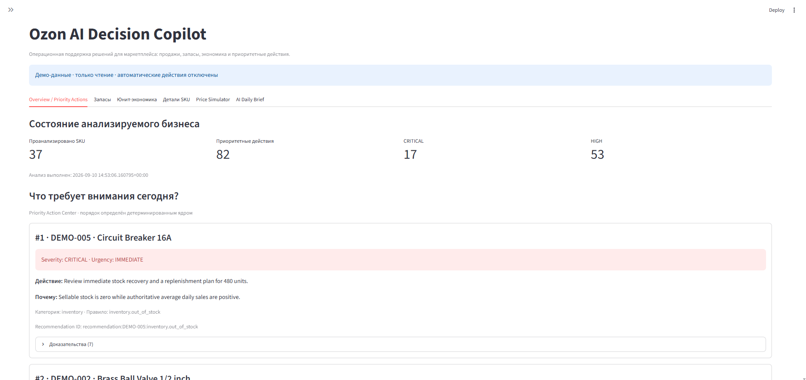
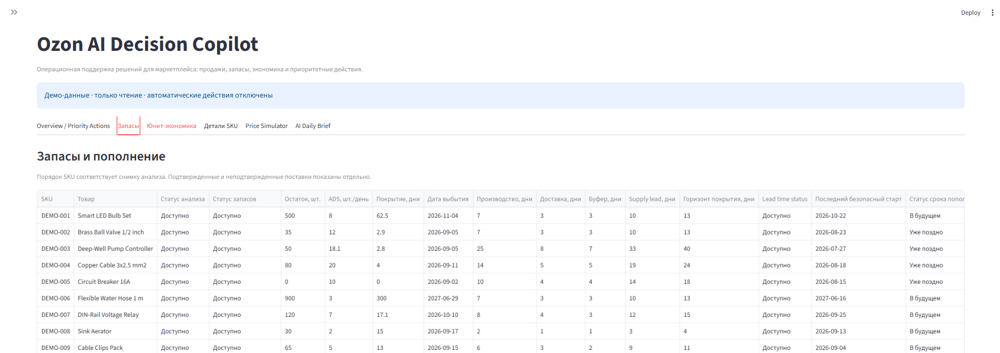
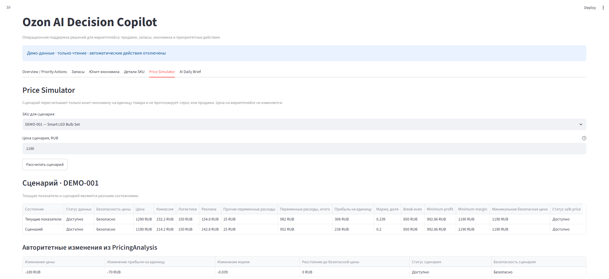

# Ozon AI Decision Copilot

Deterministic marketplace analytics and grounded AI decision support for an Ozon seller workflow.

> **Portfolio demo · synthetic local data · read-only**  
> This repository is not connected to the Ozon Seller API. It needs no Ozon credentials, performs no marketplace writes, and uses no live competitor data. All included marketplace records and results are fictional demo material.

The application combines Python analytics, explicit decision rules, a Priority Action Center, price what-if analysis, and an optional AI Daily Brief in a Streamlit dashboard. Its governing boundary is simple:

> **Python calculates. AI interprets and explains. A human approves any future action.**

## My Role

This project was developed with extensive AI coding assistance.

My role included:

- defining the product idea and business requirements;
- describing the expected user flows and application logic;
- breaking the project into implementation tasks;
- making product and architecture decisions together with AI coding tools;
- reviewing generated implementations and testing the result;
- checking that the application behavior matches the intended business logic;
- iterating on the project based on detected issues and test results.

I can explain the purpose of the system, its main architecture, data flow,
business logic and how its major components work.

I use AI coding tools as part of the development process rather than claiming
that every line of code was written manually.

## Screenshots

These genuine Streamlit captures use the repository's synthetic local demo data in read-only mode. They do not show a live Ozon connection or production deployment.

### Executive overview and Priority Action Center



### Inventory and replenishment timing



### Price what-if simulator



The submitted price scenario recalculates per-unit economics only. It does not forecast demand or sales and does not change a marketplace price.

## The problem

A marketplace manager often has to inspect sales movement, stock coverage, supply lead time, unit economics, and pricing constraints SKU by SKU. This project consolidates those inputs into one evidence-backed workflow that answers: **What requires attention today?**

It is a portfolio project modeled around an Ozon seller workflow—not a deployed seller system and not evidence of real Ozon API access.

## What the product does

- Loads a deterministic catalog of synthetic marketplace and unit-economics data through replaceable providers.
- Calculates sales velocity and material period-over-period change.
- Calculates inventory coverage, projected stockout timing, safe replenishment start dates, and replenishment quantity.
- Calculates per-unit contribution economics, DRR where source data exists, break-even boundaries, and minimum safe prices.
- Applies deterministic inventory, profitability, pricing, and sales rules.
- Ranks every recommendation in a stable Priority Action Center with inspectable evidence and provenance.
- Lets a user recalculate per-unit economics for a hypothetical price without changing source data.
- Optionally turns allow-listed actions and facts into a validated, grounded AI Daily Brief.
- Presents executive, inventory, economics, SKU-detail, pricing, and brief views in Streamlit.

The fixed default demo currently analyzes 37 active SKUs and produces 82 individual Priority Actions: 17 `CRITICAL` and 53 `HIGH`. These are reproducible fixture outputs, not customer or production metrics.

## Architecture

The project is one modular Python application. External-source details stay at provider boundaries; business truth stays in deterministic modules; Streamlit is presentation only.

```text
Synthetic demo providers
          |
          v
Normalized domain models
          |
          v
Deterministic Python analytics
          |
          v
Deterministic decision rules
          |
          v
Priority Action Center
          |
          v
Application services ---------> Streamlit UI
          |
          v
Allow-listed grounded facts
          |
          v
Optional LLM -> strict validation -> AI Daily Brief
```

The AI path is downstream of completed business analysis. It cannot feed values, classifications, recommendations, or priority changes back into the deterministic system.

### Module responsibilities

| Area | Responsibility |
|---|---|
| `app/providers/` | Replaceable source adapters for synthetic marketplace and local economics data. |
| `app/domain/` | Immutable, source-independent business and result models. |
| `app/analytics/` | Pure deterministic sales, inventory, economics, and pricing calculations. |
| `app/decisions/` | Deterministic rules, explanations, evidence, severity, urgency, and priority order. |
| `app/services/` | In-process use-case orchestration; no duplicated formulas. |
| `app/ai/` | Grounded input, OpenAI adapter, structured draft handling, and deterministic output validation. |
| `app/ui/` | Presentation models and Streamlit components; no business calculations or reranking. |
| `streamlit_app.py` | Composition and interactions for the read-only demo UI. |

For the complete design, see [ARCHITECTURE.md](ARCHITECTURE.md).

## Python, AI, and human boundaries

| Feature | Source of truth | AI involved? | Write or execution? |
|---|---|---:|---:|
| Sales metrics and change status | Deterministic Python | No | No |
| Inventory risk and replenishment | Deterministic Python | No | No |
| Unit economics and price safety | Deterministic Python | No | No |
| Hypothetical price scenario | Deterministic Python | No | No |
| Recommendation and priority order | Deterministic Python | No | No |
| Daily Brief prose | Validated AI over approved facts | Yes, optional | No |

The MVP has no automatic repricing, replenishment order, stock update, or other marketplace mutation. Any future external action must show its exact target and calculated evidence, require action-specific human approval, and be revalidated immediately before execution.

## Engineering choices

- **Decimal money:** authoritative financial inputs and outputs never pass through binary `float`; currency and upward safe-price rounding are explicit.
- **Exact inventory boundaries:** exact rational arithmetic is used where fractional sales rates determine authoritative unit/date boundaries; decimalized values are presentation outputs.
- **Injected clock:** tests can pin analysis time so identical inputs remain reproducible.
- **Provider ports:** `MockOzonProvider` and `LocalUnitEconomicsProvider` can be replaced without moving file or API concerns into analytics.
- **Immutable models:** domain, result, and presentation objects protect completed analysis from downstream mutation.
- **Evidence-first decisions:** each recommendation carries stable rule and fact references; priority ordering is categorical and deterministic.
- **Grounded AI:** the LLM receives only the evidence closure of already-ranked actions and returns a strict structured draft that Python validates.
- **Graceful AI degradation:** `DISABLED`, `UNAVAILABLE`, and `INVALID` brief states do not affect the dashboard's deterministic facts.
- **Grounding identity:** a digest of canonical grounded input prevents a validated brief from being shown against a different snapshot.
- **Read-only scenarios:** price what-if analysis is separate from both source state and marketplace execution.

## Pricing simulator: what it means

The simulator changes one hypothetical selling price and reruns the same per-unit economics engine used for current analysis. It reports the resulting contribution, margin, safe-price distance, and safety status while holding the supplied cost/rate assumptions constant.

It does **not** forecast sales, demand, conversion, market share, future revenue, or total future profit. There is no elasticity or optimization model, and a scenario never changes a marketplace price.

## Grounded AI Daily Brief

```text
AnalysisSnapshot
  -> action-centric GroundedBriefInput
  -> optional OpenAI model
  -> strict structured draft
  -> deterministic reference and claim validation
  -> validated DailyBrief
  -> Streamlit
```

`GroundedBriefInput` is the AI's sole business authority. Python preserves exact action order and permits only referenced facts. Unsupported action/SKU/reference claims, unsupported numeric or date claims, malformed output, and refusals fail closed as `INVALID`. Provider availability problems become `UNAVAILABLE`; disabled mode is `DISABLED`. Only `GENERATED` may contain prose shown as a validated brief.

AI generation is optional. The current adapter uses the OpenAI Responses API with strict Structured Outputs and defaults to `gpt-5.6-terra`, but deterministic operation does not require the model, a network connection, or an API key.

## Demo scenarios

The synthetic dataset includes the nine source-defined situations locked by the end-to-end suite:

| Scenario | Representative SKU | What to inspect |
|---|---|---|
| `healthy_inventory` | `DEMO-001` | Stable demand and comfortable stock. |
| `near_stockout` | `DEMO-002` | Low coverage and an already-late replenishment start. |
| `already_late_replenishment` | `DEMO-004` | Stock pressure, lead-time timing, and confirmed inbound treatment. |
| `overstock_candidate` | `DEMO-006` | 300 days of coverage alongside a material sales decline. |
| `low_margin` | `DEMO-019` | Positive contribution but a minimum-margin violation. |
| `below_safe_price` | `DEMO-023` | Current price below the calculated safe boundary. |
| `sales_decline` | `DEMO-006` | Recent average sales 75% below the comparison period. |
| `sales_increase` | `DEMO-010` | A material increase reported without a causal claim. |
| `pricing_opportunity` | `DEMO-024` | Favorable factual economics and price headroom. The MVP intentionally defines no unsupported “pricing opportunity” recommendation rule. |

Additional fixtures exercise missing lead time, incomplete sales history, missing COGS, unconfirmed inbound, and a cost model with no finite safe price. See [the demo dataset notes](data/demo/README.md).

## Tech stack

- Python 3.11+
- Streamlit 1.x
- OpenAI Python SDK 2.x for the optional brief adapter
- pytest 9.x for automated verification
- Python standard-library dataclasses, `Decimal`, and `Fraction` for the core domain and calculations

No FastAPI, database server, Docker, message broker, LangChain, n8n, Telegram adapter, or real Ozon client is implemented in this MVP.

## Quick start

### Windows PowerShell (verified project environment)

Python 3.11.9 was used for final MVP verification.

```powershell
py -3.11 -m venv .venv
.\.venv\Scripts\python.exe -m pip install --upgrade pip
.\.venv\Scripts\python.exe -m pip install -e ".[test]"
$env:OZON_COPILOT_AI_ENABLED = "false"
.\.venv\Scripts\python.exe -m streamlit run streamlit_app.py
```

Open the local URL printed by Streamlit. With AI disabled, no `OPENAI_API_KEY` is needed.

### macOS/Linux equivalent (not verified in this Windows-only rehearsal)

```bash
python3.11 -m venv .venv
source .venv/bin/activate
python -m pip install --upgrade pip
python -m pip install -e ".[test]"
export OZON_COPILOT_AI_ENABLED=false
python -m streamlit run streamlit_app.py
```

### Optional AI mode

Set secrets only in the process environment—never in source files:

```powershell
$env:OZON_COPILOT_AI_ENABLED = "true"
$env:OPENAI_API_KEY = "<your-own-key>"
# Optional; the implemented default is gpt-5.6-terra
$env:OZON_COPILOT_AI_MODEL = "gpt-5.6-terra"
.\.venv\Scripts\python.exe -m streamlit run streamlit_app.py
```

The AI tab invokes the provider only after the user explicitly requests a brief. AI-disabled mode is the default and is the recommended no-cost portfolio walkthrough.

## Testing

Run the complete suite:

```powershell
.\.venv\Scripts\python.exe -m pytest -p no:cacheprovider
```

At the final MVP-020 documentation verification, **838 tests passed**. The high-value end-to-end suite at [`tests/integration/test_end_to_end.py`](tests/integration/test_end_to_end.py) covers the nine business scenarios, provider replacement, partial-data handling, pricing boundaries, AI degradation, fixed-clock repeatability, and offline Streamlit startup.

Check installed dependency consistency with:

```powershell
.\.venv\Scripts\python.exe -m pip check
```

## Repository structure

```text
.
|-- app/
|   |-- core/          # configuration, money, clock, safe errors
|   |-- domain/        # immutable business/result contracts
|   |-- providers/     # mock/local adapters and read ports
|   |-- analytics/     # deterministic calculations
|   |-- decisions/     # rules and stable priority ordering
|   |-- services/      # analysis, pricing, brief use cases
|   |-- ai/            # grounded input, adapter, validation
|   `-- ui/            # presenters and Streamlit components
|-- data/demo/         # synthetic, provenance-labeled source inputs
|-- tests/             # unit and integration verification
|-- docs/              # interview walkthrough and capture checklist
|-- streamlit_app.py   # demo entry point
`-- pyproject.toml
```

## Limitations

- All marketplace and economics inputs are synthetic local demo data.
- There is no real Ozon Seller API connection or credential handling.
- There are no marketplace writes or automatic operational actions.
- There is no demand forecast, price elasticity, optimization, or sales prediction.
- There is no live competitor-price provider.
- There is no production deployment, authentication, persistent database, or cloud infrastructure.
- The AI Daily Brief is optional and requires network access plus the user's own OpenAI key when enabled.
- Real external integrations are intentionally deferred until their contracts and permissions can be verified.

## Future work (not implemented)

- A real **read-only** Ozon adapter after API access and field semantics are verified.
- A replaceable Google Sheets unit-economics provider.
- A separately sourced competitor-price provider with explicit provenance.
- A thin read-only FastAPI adapter.
- Telegram or n8n delivery around completed, deterministic outputs.
- A separately designed human-approved external-action workflow with revalidation and audit.

## What this project demonstrates

- Translating marketplace operations into explicit, testable software rules.
- Modular Python design with replaceable external boundaries.
- Safe Decimal and exact-boundary handling for business calculations.
- Separation of deterministic business truth from generative explanation.
- Grounded structured LLM integration with fail-closed validation.
- Honest handling of missing data and optional-service failure.
- Human-in-the-loop and read-only safety by design.
- End-to-end verification of a reproducible employer demo.

## Demo guide

Use the [5–8 minute employer demo script](docs/demo-script.md) for a concise walkthrough, representative SKUs, interview talk track, and recording/screenshot safety checklist.
